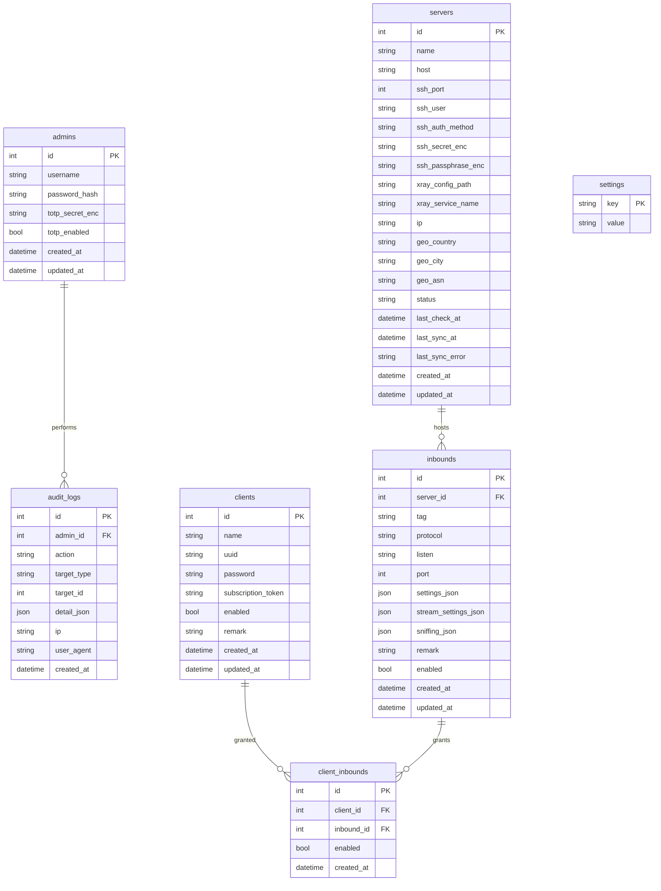

# SPEC — Панель управления Xray

Детальная спецификация проекта. Читается вместе с `CLAUDE.md` (правила работы) и
`docs/ROADMAP.md` (порядок реализации). Здесь — «что строим и почему», без порядка шагов.

---

## 1. Цель и границы

Панель для **личного** централизованного управления несколькими собственными VPS, на каждом
из которых установлен Xray. Одна панель на главном VPS управляет всеми экземплярами Xray по SSH.

**В проекте НЕТ и не должно появиться:** биллинга, платежей, лимитов и учёта трафика по
клиентам, тарифов, рефералок, партнёрских и любых коммерческих функций, мультиарендности
(один админ).

**Ключевое отличие от «просто панели»:** клиент получает доступ **не к серверу целиком, а к
конкретным inbound-конфигурациям**. Один сервер может нести несколько inbound-ов разных типов;
подписка клиента автоматически собирается из всех разрешённых ему inbound-ов на всех серверах.

---

## 2. Архитектура (высокоуровнево)

```
┌─────────────────────────────────────────────────────────────┐
│  Главный VPS                                                  │
│                                                              │
│  ┌────────────┐   HTTPS    ┌──────────────────────────────┐  │
│  │  Caddy     │──────────► │  Frontend (React SPA, static) │  │
│  │ (TLS,      │            └──────────────────────────────┘  │
│  │  reverse   │   /api/*   ┌──────────────────────────────┐  │
│  │  proxy)    │──────────► │  Backend (Go)                 │  │
│  │            │   /sub/*   │   ├─ REST API + Swagger        │  │
│  └────────────┘            │   ├─ Auth (bcrypt + TOTP)      │  │
│                            │   ├─ SSH-менеджер серверов     │  │
│        (опц.) Xray ◄───────│   ├─ Реестр протоколов         │  │
│         на этом же VPS      │   ├─ Sync-движок (конфиг→SSH)  │  │
│                            │   └─ SQLite                    │  │
│                            └───────────────┬───────────────┘  │
└────────────────────────────────────────────┼─────────────────┘
                                     SSH      │
                        ┌─────────────────────┼─────────────────────┐
                        ▼                     ▼                     ▼
                   VPS #2 (Xray)         VPS #3 (Xray)      ...любой сервер
```

**Как панель управляет Xray на серверах — основной механизм: SSH + управление файлом конфига.**
Панель по SSH подключается к серверу, генерирует полный `config.json` для Xray из его inbound-ов
и всех выданных на них клиентов, кладёт файл (с бэкапом предыдущего), валидирует
(`xray -test -config ...`) и перезапускает сервис (`systemctl restart <service>` или заданная
команда). Это надёжнее и проще, чем runtime-API, и напрямую покрывает требования ТЗ
(«перезапуск Xray через интерфейс», «CPU/RAM/диск через SSH»).

> *Опциональное улучшение на будущее:* горячее добавление пользователей через gRPC HandlerService
> Xray без рестарта. В MVP не делаем — оставляем полную регенерацию конфига + рестарт.

---

## 3. Технологии

**Backend (Go):**
- HTTP-роутер: `chi` (лёгкий, stdlib-совместимый). GORM/gin — допустимая альтернатива, но по
  умолчанию идём на chi.
- Доступ к БД: `sqlc` (типобезопасные запросы) + миграции через `golang-migrate`. GORM допустим,
  если Claude Code обоснует в PROGRESS.md.
- SSH: `golang.org/x/crypto/ssh` (обязательно по ТЗ).
- TOTP: `github.com/pquerna/otp`. UUID: `github.com/google/uuid`. QR: `github.com/skip2/go-qrcode`.
- Хэши: `golang.org/x/crypto/bcrypt` (cost 12). Шифрование: stdlib `crypto/aes` + `crypto/cipher` (GCM).
- OpenAPI/Swagger: design-first `docs/openapi.yaml`, поддерживается в синхроне через `swaggo/swag`.

**Frontend (React + TypeScript):**
- Vite, React Router, TanStack Query (data-fetching/кэш).
- UI: Tailwind CSS + shadcn/ui (для «современного минималистичного» вида и тёмной/светлой темы).
  Mantine — допустимая альтернатива.
- Тема: dark/light через CSS-переменные, переключатель сохраняется (в БД настроек или локально).

**Хранилище:** SQLite (файл в volume). Схема и слой доступа спроектированы так, чтобы позже
можно было перейти на Postgres минимальными правками (без сырых SQLite-специфичных хаков в бизнес-логике).

**Развёртывание:** Docker Compose — сервисы `backend`, `frontend` (или статик через Caddy) и
`caddy` (TLS + reverse proxy). Один `docker compose up` поднимает всё.

---

## 4. Модель данных

Протокол-специфичные параметры хранятся в **JSON-полях**, а не в отдельных колонках. Это и есть
механизм «добавить новый протокол без изменения схемы БД».



**Пояснения:**

- **`inbounds`** — `protocol` это строка (`vless`/`vmess`/`trojan`/`shadowsocks`/…). Всё, что
  специфично для протокола/транспорта/безопасности (например, ключи Reality, `flow`, ALPN, SNI,
  path для ws/grpc), живёт в `settings_json` / `stream_settings_json`. Добавление протокола не
  требует ALTER TABLE.
- **`clients`** — генерим при создании: `uuid` (для протоколов на UUID: VLESS/VMess) и `password`
  (для протоколов на пароле: Trojan/Shadowsocks/будущий Hysteria2). Оба поля стабильны и покрывают
  и нынешние, и большинство будущих протоколов без изменения схемы. `subscription_token` —
  случайный неугадываемый токен для подписки.
- **`client_inbounds`** — junction «многие-ко-многим»: конкретный клиент допущен к конкретному
  inbound-у. `enabled` на уровне выдачи позволяет точечно выключать доступ. Уникальность
  `(client_id, inbound_id)`.
- **`settings`** — key-value: домен панели / базовый URL подписки, интервал синхронизации и т.п.
- **`servers`** — `status`, `last_check_at`, `last_sync_at`, `last_sync_error` обслуживают
  дашборд и журнал синхронизаций. `ip/geo_*` кэшируются при проверке доступности.

---

## 5. Расширяемость протоколов (реестр)

Единственная точка, где живёт знание о протоколе, — Go-интерфейс + реестр:

```go
type Protocol interface {
    Name() string
    // Собрать объект inbound для config.json Xray из inbound-а и выданных на него клиентов.
    BuildInbound(in Inbound, grants []ClientGrant) (json.RawMessage, error)
    // Собрать subscription-URI для одного клиента на этом inbound-е (vless://…, trojan://… и т.д.).
    BuildLink(srv Server, in Inbound, c Client) (string, error)
}

// registry: map[string]Protocol. Регистрируем vless, vmess, trojan, shadowsocks.
// Добавить протокол = реализовать интерфейс + зарегистрировать. Миграций БД нет.
```

**MVP реализует только протоколы, нативные для xray-core:**
- **VLESS + REALITY** (`flow=xtls-rprx-vision`) — основной, самый маскируемый.
- **VLESS + TLS** (ws/grpc/tcp+tls).
- **VMess**.
- **Trojan**.
- **Shadowsocks** (как пример протокола на пароле).

**Про Hysteria2 (важное техническое ограничение):** Hysteria2 — это QUIC-протокол проекта Hysteria,
его сервер **не реализован в xray-core**, поэтому он не может быть inbound-ом в `config.json` Xray.
В нашем SSH-конфиг-механизме он в MVP не поддерживается. Реестр спроектирован так, чтобы адаптер
Hysteria2 (поверх отдельного бинарника hysteria или sing-box на ноде) можно было добавить позже
без изменения схемы БД. В `docs/QUESTIONS.md` зафиксировать это как явное будущее решение, если
пользователю Hysteria2 нужен.

---

## 6. Функционал

### 6.1 Серверы
Добавление/удаление; хранение SSH-подключения в БД (секрет зашифрован); проверка доступности;
определение статуса Xray на сервере; IP и геолокация; перезапуск Xray из интерфейса; снятие
метрик CPU/RAM/диск по SSH.

### 6.2 Inbound-ы
CRUD inbound-ов в рамках сервера; выбор протокола и его параметров (форма подставляет разумные
дефолты, ключи Reality генерируются на бэкенде); включение/выключение; при изменении — регенерация
и пуш конфига на соответствующий сервер.

### 6.3 Клиенты
Создание одной кнопкой (генерация UUID и токена); переименование; удаление; отключение без удаления
(`enabled=false`); выдача/отзыв доступа к одному или нескольким inbound-ам (это и есть выбор
«на каких серверах/протоколах» живёт клиент).

### 6.4 Выдача конфигурации клиенту
После создания — готовая ссылка подключения, QR-код, скачивание конфиг-файла, кнопка «Обновить
конфигурацию» (ротация токена/пересборка). Пользователь ничего не настраивает вручную.

### 6.5 Механизм обновления конфигурации (подписка)
- У клиента — уникальный `subscription_token`.
- Публичный HTTPS-эндпоинт `GET /sub/{token}` отдаёт актуальную подписку: для каждого разрешённого
  и включённого inbound-а клиента на всех серверах генерируется URI, список кодируется в base64
  (стандартный формат v2ray-подписки).
- Клиентское приложение (v2rayN/v2rayNG/Streisand и пр.) периодически опрашивает URL → автообновление.
- При смене сервера/ключей/домена/маршрутов панель пересобирает — следующий опрос отдаёт свежий конфиг.
- Эндпоинт rate-limited; токен ротируется кнопкой «Обновить конфигурацию».

### 6.6 Sync-движок
При любом изменении, влияющем на сервер (добавлен/изменён inbound, выдан/отозван доступ клиента,
клиент включён/выключен): собрать полный `config.json` сервера → SSH: бэкап текущего → записать
новый → `xray -test` → рестарт сервиса → записать `last_sync_at`/результат. Идемпотентно:
сравнивать хэш, пустые пуши пропускать.

---

## 7. Безопасность

- Аутентификация админа: логин + пароль (**bcrypt**, cost 12), затем **TOTP** (2FA), если включён.
- Сессия: JWT короткоживущий + refresh, либо httpOnly-cookie сессия. Rate-limit на логин и `/sub`.
- **Секреты at-rest — AES-256-GCM**, мастер-ключ из `PANEL_ENCRYPTION_KEY` (32 байта, base64):
  SSH-ключ/пароль (`ssh_secret_enc`, `ssh_passphrase_enc`), TOTP-секрет (`totp_secret_enc`).
- HTTPS обязателен — через Caddy (авто-Let's Encrypt) в compose либо сертификаты пользователя.
- **Все административные действия логируются** в `audit_logs` (кто, что, над чем, IP, время).
- Хостовые файлы Xray на нодах трогаются только через фиксированные пути/команды из `servers`.

---

## 8. Интерфейс

Страницы: **Login** (с шагом TOTP) · **Dashboard** (карточки серверов: online-статус, CPU/RAM/диск,
время последней синхронизации; сводные счётчики клиентов/серверов) · **Servers** (список + деталь
сервера с его inbound-ами, кнопки «проверить», «перезапустить Xray») · **Clients** (список + деталь
клиента: выдача доступа к inbound-ам чекбоксами, ссылка, QR, скачать, обновить) · **Settings**
(домен/базовый URL подписки, тема, 2FA) · **Logs** (журнал действий).
Тема тёмная/светлая. Стиль — современный минимализм.

---

## 9. Статистика (дашборд)
Количество клиентов; количество серверов; online-статус каждого сервера; CPU/RAM/диск на каждом
VPS (по SSH); время последней синхронизации (общее и по серверу).

---

## 10. REST API (основная поверхность)

Design-first: полный контракт — в `docs/openapi.yaml`, отражается в Swagger `/swagger`.

```
Auth
  POST   /api/auth/login              {username,password} -> {token | need_2fa}
  POST   /api/auth/2fa/verify         {code}
  POST   /api/auth/2fa/setup          -> {otpauth_url, qr}
  POST   /api/auth/2fa/enable         {code}
  POST   /api/auth/logout
  GET    /api/auth/me

Servers
  GET    /api/servers
  POST   /api/servers
  GET    /api/servers/{id}
  PUT    /api/servers/{id}
  DELETE /api/servers/{id}
  POST   /api/servers/{id}/check          # доступность + geo/ip + статус Xray
  POST   /api/servers/{id}/restart-xray
  GET    /api/servers/{id}/stats          # CPU/RAM/диск по SSH

Inbounds
  GET    /api/servers/{id}/inbounds
  POST   /api/servers/{id}/inbounds
  GET    /api/inbounds/{id}
  PUT    /api/inbounds/{id}
  DELETE /api/inbounds/{id}

Clients
  GET    /api/clients
  POST   /api/clients
  GET    /api/clients/{id}
  PUT    /api/clients/{id}                 # переименование и т.п.
  DELETE /api/clients/{id}
  POST   /api/clients/{id}/enable
  POST   /api/clients/{id}/disable
  PUT    /api/clients/{id}/inbounds        # выдать/отозвать доступ (список inbound_id)
  POST   /api/clients/{id}/rotate-token    # «Обновить конфигурацию»
  GET    /api/clients/{id}/links           # готовые URI
  GET    /api/clients/{id}/qrcode
  GET    /api/clients/{id}/config          # скачать конфиг-файл

Subscription (публично, по токену)
  GET    /sub/{token}                      # base64-подписка из всех разрешённых inbound-ов

Прочее
  GET    /api/dashboard/summary
  GET    /api/logs
  GET    /api/settings
  PUT    /api/settings
  GET    /healthz
  GET    /readyz
  GET    /swagger/*
```

---

## 11. Структура репозитория (целевая)

```
xray-panel/
├── CLAUDE.md
├── README.md
├── docker-compose.yml
├── .env.example
├── .gitignore
├── .claude/
│   └── settings.json
├── docs/
│   ├── SPEC.md          # этот файл
│   ├── ROADMAP.md
│   ├── ARCHITECTURE.md  # создаётся в Фазе 0
│   ├── ERD.md           # mermaid, Фаза 0
│   ├── openapi.yaml     # контракт API
│   ├── PROGRESS.md      # журнал выполнения (ведёт Claude Code)
│   └── QUESTIONS.md     # блокеры/вопросы к человеку
├── backend/
│   ├── cmd/panel/main.go
│   ├── internal/
│   │   ├── config/      # чтение env, валидация
│   │   ├── crypto/      # aes-gcm, bcrypt
│   │   ├── db/          # подключение, sqlc-queries
│   │   ├── migrations/  # *.up.sql / *.down.sql
│   │   ├── auth/        # login, jwt/session, totp
│   │   ├── audit/       # запись действий
│   │   ├── ssh/         # клиент, exec, метрики (за интерфейсом → мокается)
│   │   ├── servers/
│   │   ├── inbounds/
│   │   ├── clients/
│   │   ├── protocols/   # registry + vless/vmess/trojan/shadowsocks (+ hysteria2 stub)
│   │   ├── sync/        # сборка config.json + пуш по SSH
│   │   ├── subscription/
│   │   ├── httpapi/     # router, handlers, middleware
│   │   └── logging/
│   ├── go.mod
│   └── Dockerfile
├── frontend/
│   ├── src/
│   │   ├── pages/        # Login, Dashboard, Servers, ServerDetail, Clients, ClientDetail, Settings, Logs
│   │   ├── components/
│   │   ├── api/          # клиент к REST + типы
│   │   ├── theme/        # dark/light
│   │   └── main.tsx
│   ├── package.json
│   ├── vite.config.ts
│   └── Dockerfile
├── deploy/
│   └── Caddyfile
└── test/
    ├── integration/      # e2e против поднятого стека
    └── xray-node/        # dockerized Xray-нода для локальной интеграции sync-движка
```

---

## 12. Тестирование

- **Backend:** `go test ./...`, table-driven. SSH — за интерфейсом, в юнит-тестах мок. Sync-движок
  интеграционно проверяется против **локальной dockerized-ноды Xray** (`test/xray-node`): пушим
  конфиг, ассертим, что `xray -test` его принимает.
- **Frontend:** vitest + testing-library; опционально Playwright-smoke на собранном приложении.
- **Smoke целиком:** `docker compose up` → curl `/healthz` → логин → создать сервер (мок) →
  создать клиента → выдать inbound → `GET /sub/{token}` возвращает непустую валидную подписку.

Реальные три VPS в CI/разработке не используются — их подключает человек на финальном шаге.
