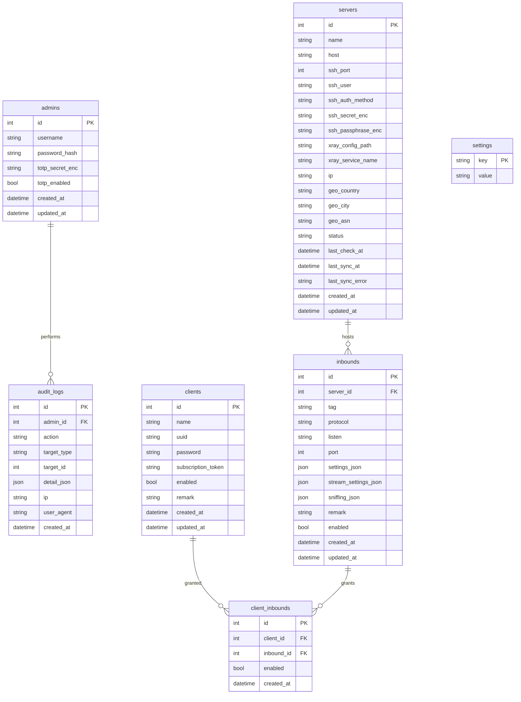

# ERD — модель данных

ER-диаграмма панели. Источник истины по схеме — миграции в
`backend/internal/migrations`. Диаграмма отражает `SPEC.md §4`.

## Инварианты

- `client_inbounds` уникален по `(client_id, inbound_id)`.
- `inbounds.protocol` — строка из реестра протоколов; протокол-специфичные
  параметры в `*_json`, ALTER TABLE при добавлении протокола не требуется.
- `servers.ssh_secret_enc`, `servers.ssh_passphrase_enc`,
  `admins.totp_secret_enc` — AES-256-GCM (base64), не хранятся в открытом виде.
- `admins.password_hash` — bcrypt (cost 12).
- `clients.uuid` покрывает UUID-протоколы (VLESS/VMess), `clients.password` —
  парольные (Trojan/Shadowsocks). Оба генерируются при создании клиента.
